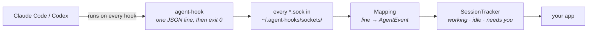
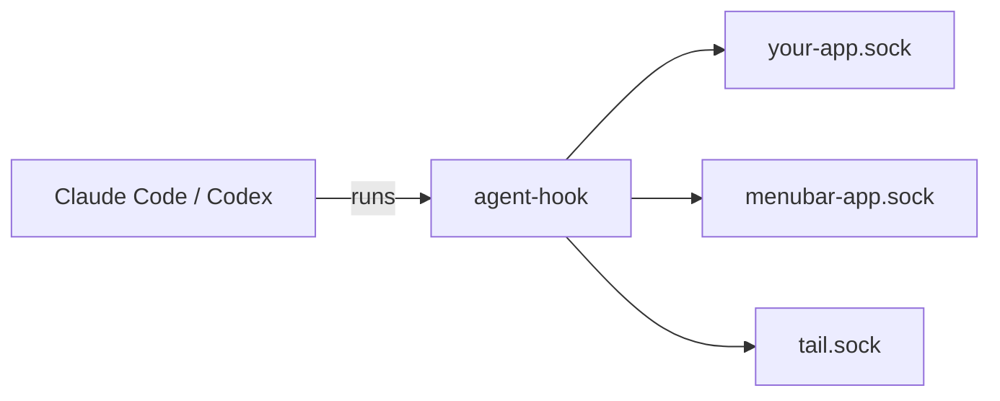

# How agent-hooks works

Updated 2026-10-07. [README.md](README.md) is the short version. This is
the tour: how the hooks get installed, what happens each time one fires,
and how that becomes a list of sessions. The code and its tests have
every rule.



The sections follow that path, left to right.

## 1. Installing the hooks

`agent-hooks install` adds one entry for each hook it uses:

| File | What it adds |
| --- | --- |
| `~/.claude/settings.json` | An entry for each of Claude Code's 14 hooks |
| `~/.codex/hooks.json` | An entry for each of Codex's 8 hooks |
| `~/.codex/config.toml` | `codex_hooks = true`, which Codex needs to run hooks at all |

Every entry runs the `agent-hook` sitting next to `agent-hooks`. So copy
both somewhere stable first, as the README does: if they stay in the
build folder, cleaning it breaks every hook. `--hook PATH` points the
entries at a client somewhere else.

**It leaves everything else alone.** It recognises its own entries by
the program they run, and never touches anyone else's hooks. A settings
file that's a symlink (a dotfiles setup) is written through, not
replaced, and nothing is written when nothing would change. Installing
twice is the same as installing once.

It does reformat the two JSON files: when it changes one, it writes the
whole file back pretty-printed, with its keys sorted. What's in them
stays the same, but the layout and key order may not.

**It knows when it's out of date.** `agent-hooks status` checks each
agent and reports one of:

| Health | Meaning |
| --- | --- |
| installed | The entries are exactly what a fresh install would write |
| outdated | Some are missing or old, say after an update added a hook |
| not installed | None of its entries are there |
| hooks off | Its entries are there, but you turned the agent's hooks off |
| client missing | There's no `agent-hook` where the entries point |
| unreadable | The settings file is there but isn't valid, so it's left alone |

An app can use the library's `HookInstaller` to **repair** outdated
entries every time it launches. Repair never installs for an agent that
had none, and never turns hooks back on that you turned off.

`agent-hooks remove` takes out exactly its own entries, and leaves two
things behind. `codex_hooks = true` stays in `config.toml`, since other
hooks may rely on it. And a JSON file that held only its entries is
left as an empty `{}` rather than deleted. After any of these, restart
open agent sessions: they read their hooks at startup.

## 2. The hook client

Each time a hook fires, the agent runs `agent-hook claude` (or `codex`)
and pipes it the hook's JSON. The client then:

1. **Reads** up to 256 KB, and ignores the rest.
2. **Keeps** a few plain facts: which hook, which session, the folder,
   the tool. Each is cut to 200 characters. Without a hook name and a
   session, it sends nothing.
3. **Adds** the thread's name, as the agent's app shows it, and which
   app the agent runs in.
4. **Sends** the result as one JSON line to every app listening, and
   exits.

It never prints anything, so it can never answer for the agent. It
always exits cleanly, and within a second whatever happens. Each app
gets 50 ms to take the line, so a stuck listener can't hold it up.

### Your words stay put

By default the client sends plain facts: the hook's name, the session's
ID, the folder the agent works in, the tool's name, the permission mode,
and the bundle ID of the app the agent runs in. Some hooks add a few
more, all listed under *Its fields* below: the tool call's ID, which
subagent, a command's topic, an error's class. The one thing you or the
agent wrote that leaves by default is the thread's title, as its app
shows it, and that can sum up your prompt.

Install with `--keep-text` and two more things come along, up to 2,000
characters each: your prompt, and the agent's last message. Commands,
tool output, error text, file contents and transcripts never leave.

Lines go only to Unix sockets in `~/.agent-hooks/sockets/`, a folder
only you can write to, and never over the network.

Commands still get a **topic**, worked out in memory and then
forgotten: `tests`, `build`, `deploy`, `docs`, or `inspect` for one that
only reads. To teach it your own command shapes, add them to
`~/.agent-hooks/topics.json`:

```json
{
  "tests": [["just", "check"]],
  "build": [["./build.sh"]]
}
```

## 3. Any number of apps can listen



There's no background service. An app listens on a Unix socket of its
own and links it into `~/.agent-hooks/sockets/` once. The client sends
every line to every socket in that folder, so every app hears every
hook, and none of them needs to know about the others.

The folder is yours alone (0700). If anyone else can write to it, the
client sends nothing.

For tests, `$AGENT_HOOKS_DIR` moves the folder, and `$AGENT_HOOKS_SOCKET`
sends to one socket only.

## 4. Every hook becomes an event

Claude and Codex name their hooks differently and send different
fields. `Mapping` turns each into one **event** with a **kind** (what
it's about) and a **phase** (where that thing is):

| Hook | Claude Code | Codex | Becomes |
| --- | :---: | :---: | --- |
| `SessionStart` | ✓ | ✓ | `session` start |
| `UserPromptSubmit` | ✓ | ✓ | `turn` start |
| `PreToolUse` | ✓ | ✓ | `tool` start |
| `PermissionRequest` | ✓ | ✓ | `tool` wait, asking for `permission` |
| `Elicitation` | ✓ | | `tool` wait, asking for `input` |
| `Notification`, asking | ✓ | | `tool` wait (it repeats one of the two above) |
| `PostToolUse` | ✓ | ✓ | `tool` end |
| `PostToolUseFailure` | ✓ | | `tool` end, `failed` |
| `ElicitationResult` | ✓ | | `tool` end |
| `Stop` | ✓ | ✓ | `turn` end, `done` |
| `StopFailure` | ✓ | | `turn` end, `failed` |
| `Interrupt` (Esc) | | ✓ | `turn` end, `stopped` |
| An interrupted tool call (Esc) | ✓ | | `turn` end, `stopped` |
| `Notification`, idle at the prompt | ✓ | | `turn` end, `stopped` |
| `SubagentStart`, `SubagentStop` | ✓ | | `subagent` start, end |
| `SessionEnd` | ✓ | ✓ | `session` end |

### Its fields

An event carries only the facts its hook has. These are the names
`agent-hooks tail` prints:

| Field | Example | What it says |
| --- | --- | --- |
| `agent` | `claude` | Which agent: `claude` or `codex` |
| `session` | `s1` | Which session it came from |
| `kind` | `tool` | What it's about, from the table above |
| `phase` | `wait` | Where it is, from the table above |
| `hook` | `PermissionRequest` | The agent's own name for the hook |
| `at` | `1790755425280` | When, in milliseconds |
| `cwd` | `/Users/you/src/landing` | The folder the agent works in |
| `name` | `Fix the nav` | The thread's name, as the agent's app shows it |
| `app` | `com.mitchellh.ghostty` | The app the agent runs in, by bundle ID |
| `app_session` | `local_f0ed…` | The Claude app's own ID for the session |
| `mode` | `default` | Claude's permission mode: `default`, `plan`, `acceptEdits`… |
| `subagent` | `a1b2…` | The Claude subagent it came from; none for the main agent |
| `subagent_type` | `Explore` | What kind of subagent |
| `source` | `startup` | On a `session` start: `startup`, `resume`, `clear` or `compact` |
| `prompt` | `fix the nav` | On a `turn` start: your prompt, only with `--keep-text` |
| `tool` | `Bash` | On a `tool` event: the tool |
| `tool_use_id` | `toolu_1` | On a `tool` start or end: which call |
| `topic` | `tests` | What a command is about, without the command |
| `asking` | `permission` | On a `tool` wait: `permission`, or `input` for a question |
| `notice` | `permission_prompt` | When the event came from Claude's `Notification`, its type |
| `failed` | `false` | On a Claude `tool` end: whether the call failed |
| `error` | `rate_limit` | On a failure: the error, as a short class, never its text |
| `outcome` | `done` | On a `turn` end: `done`, `failed`, or `stopped` |
| `message` | `Fixed it.` | On a `turn` end: the agent's last message, only with `--keep-text` |

In Swift these are `AgentEvent`'s properties, in camel case. It adds
**`toolKind`**, worked out from `tool`, so you needn't learn every
agent's tool names: `shell`, `edit`, `read`, `search`, `web`,
`subagent`, `planning`, `mcp` or `other`.

## 5. Events become sessions

`SessionTracker` follows the events and keeps one entry per session.
Each is **working**, **idle** or **needs you**, with its project and
workspace (from the folder's git repository, branch or worktree), its
running tool calls and its subagents.

Here's Claude asking to run the tests, as `agent-hooks tail --sessions`
printed it. First the tool call starts:

```json
{
  "agent": "claude",
  "kind": "tool",
  "phase": "start",
  "hook": "PreToolUse",
  "session": "s1",
  "tool": "Bash",
  "tool_use_id": "toolu_1",
  "topic": "tests",
  "cwd": "/Users/you/src/landing",
  "app": "com.mitchellh.ghostty",
  "mode": "default",
  "at": 1790755424947
}
```

Then Claude asks permission:

```json
{
  "agent": "claude",
  "kind": "tool",
  "phase": "wait",
  "asking": "permission",
  "hook": "PermissionRequest",
  "session": "s1",
  "tool": "Bash",
  "cwd": "/Users/you/src/landing",
  "app": "com.mitchellh.ghostty",
  "mode": "default",
  "at": 1790755425280
}
```

And the session needs you:

```json
{
  "session": "claude/s1",
  "state": "needs_you",
  "asking": "permission",
  "project": "landing",
  "workspace": "fix-nav",
  "at": 1790755425280
}
```

### Why "needs you" is the hard part

It has to be right every time, and the hooks don't make that easy:

- **The same request can arrive twice.** Claude's `Notification`
  repeats a request its own hook already made.
- **Subagents ask alongside their parent**, so one session can have
  several requests open.
- **Codex asks early.** Its hook fires before its automatic reviewer
  decides whether to ask you at all, so its requests wait 2 s before
  they count.
- **Hooks arrive late.** Some land after their session has ended, and
  mustn't bring it back.
- **Nothing reports an answer.** No hook says you approved or pressed
  Esc, so the next event has to say.

A session that's been silent for 10 minutes stops needing you, whatever
happened.

## The command line

| Command | What it does |
| --- | --- |
| `agent-hooks install [claude\|codex] [--keep-text] [--hook PATH]` | Adds the hooks for the agent named, or every one found |
| `agent-hooks remove [claude\|codex]` | Takes its entries out, leaving `codex_hooks = true` on |
| `agent-hooks status` | Each agent's health, and the apps listening |
| `agent-hooks tail [--sessions] [--name NAME]` | Prints every event, and with `--sessions` each session's state as it changes |
| `agent-hooks doctor` | `status`, then a made-up hook through the client, to check it works |

`--home DIR` points `install`, `remove`, `status` and `doctor` at
another home folder (the default is `$HOME`).

Two examples to steal:

- [Examples/watch.sh](Examples/watch.sh): your agents at a glance, in
  colour (the README's GIF).
- [Examples/needs-you-notify.sh](Examples/needs-you-notify.sh): a macOS
  notification each time an agent needs you.

## The library

Add it to your `Package.swift`:

```swift
.package(url: "https://github.com/Mellow-Machines-Lab/AgentHooks.git", from: "1.0.0"),
// and in a target's dependencies:
.product(name: "AgentHooks", package: "AgentHooks"),
```

Three pieces do the work:

- `HookServer` listens on a socket.
- `Mapping.event(from:)` turns each line into an `AgentEvent`.
- `SessionTracker` keeps the sessions. Touch it from one queue, and call
  `advance(to:)` about once a second so its timers run.

This prints each time an agent starts waiting on you:

```swift
import AgentHooks
import Foundation

/// Prints each time an agent session starts waiting on you.
final class Watcher: @unchecked Sendable {
    let queue = DispatchQueue(label: "watcher")  // the tracker's one queue
    let tracker = SessionTracker()
    var waiting: Set<String> = []
    var keep: [Any] = []

    func now() -> Int64 { Int64(Date().timeIntervalSince1970 * 1000) }

    func start(socket: String) throws {
        let server = HookServer(path: socket) { [self] line in
            queue.async { [self] in
                guard let event = Mapping.event(from: line, receivedAt: now()) else { return }
                tracker.handle(event)
                report()
            }
        }
        try server.start()
        try HookSocket.register(socket, as: "needs-you")  // agent-hook now sends here too
        // The timers: Codex's 2 s grace, the 10-minute safety net.
        let tick = DispatchSource.makeTimerSource(queue: queue)
        tick.schedule(deadline: .now() + 1, repeating: 1)
        tick.setEventHandler { [self] in
            tracker.advance(to: now())
            report()
        }
        tick.resume()
        keep = [server, tick]
    }

    func report() {
        let asking = tracker.grouped(at: now()).waiting
        for s in asking where !waiting.contains(s.key) {
            let what = s.asking == .input ? "has a question" : "wants permission"
            print("\(s.agent.displayName) in \(s.name ?? s.project) \(what)")
        }
        waiting = Set(asking.map(\.key))
    }
}

let watcher = Watcher()
try watcher.start(socket: NSTemporaryDirectory() + "needs-you.sock")
dispatchMain()
```

The library has a few more pieces for apps:

- `HookInstaller` installs, checks and repairs the hooks, from your
  own app.
- `Place` and `Places` name a folder's project and workspace.
- `ThreadLink` opens a session's thread in the app it runs in.

## Good to know

- **Some of it reads undocumented internals**: the thread's name
  (Claude's transcript, Codex's `session_index.jsonl`), which app the
  agent runs in, and what Claude's idle notification means. An agent
  update can break these. If one does, the name goes missing or the
  thread doesn't open, but the events still come.
- **Hooks can't see everything.** No hook says you approved, so a long
  command you approved keeps "needs you" up until it finishes. Codex's
  automatic reviewer sends no hook either, so a command it approves that
  runs past the 2 s grace shows "needs you" when nobody was asked.
- **Apps share one set of entries.** Apps that install hooks must agree
  on the client's path and on `--keep-text`, or each one's repair undoes
  the other's.
- **Tested against** Claude Code 2.1.263 and Codex CLI 0.153.4
  ([the fixtures](Tests/AgentHooksTests/Fixtures/VERSIONS.md)). macOS
  only.

## Development

```sh
swift test --scratch-path .build/tests
```

The tests use Swift Testing, and the recorded hooks are in
`Tests/AgentHooksTests/Fixtures/`. The package depends on nothing but
Foundation, and on nothing outside this folder. The README's GIF is a
real run of `Examples/watch.sh`. [CONTRIBUTING.md](CONTRIBUTING.md) says
how to send a change.
