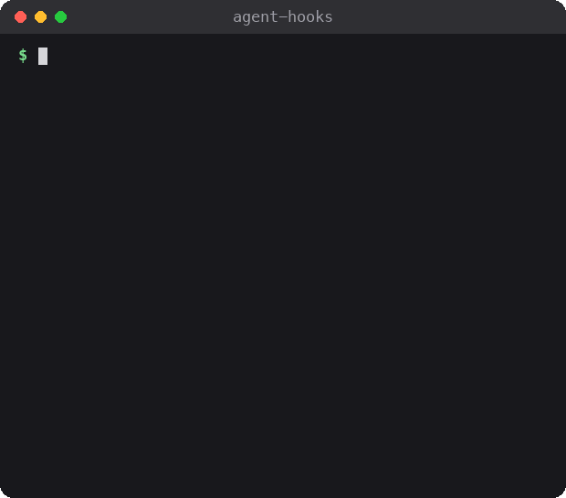
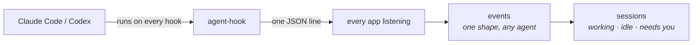

<p align="center">
  
</p>

<h1 align="center">🪝 agent-hooks</h1>

<p align="center">
  <b>Tells you which of your coding agents needs you.</b>
</p>

<p align="center">
  
  
  
  
</p>

You've got three Claude sessions and two Codex threads going, and one of
them has been waiting on you for ten minutes. agent-hooks knows which.
For every session, it tells you whether it's **working**, **idle** or
**needs you**.

- 🪝 **Installs once** for both Claude Code and Codex, and keeps its hooks up to date.
- 📨 **Speaks one language**: every hook, from either agent, becomes the same event.
- 🚦 **Keeps the list** of sessions, with the fiddly "needs you" rules already worked out.
- 🧩 **Lets you build on it**: a command line, a Swift library, and a socket any number of apps can listen on.
- 🤐 **Keeps quiet**: no prompts, commands, output or files leave the hook, and nothing goes over the network.

It only watches: it can't approve, deny or block anything an agent does,
and if nobody is listening, the hook gives up in milliseconds.

## How it works

Claude Code and Codex can run a command at set moments: a prompt sent, a
tool about to run, a permission asked, a turn finished. Those are
**hooks**. agent-hooks puts a tiny program in each one, and turns what
they report into sessions.



agent-hooks is one Swift package with three pieces. The library is the
base, and the command line is that library made usable from a terminal.
Only the hook client stands apart: it's kept tiny so it starts fast.

| Piece | What it is |
| --- | --- |
| `AgentHooks` | **The library, and the base of everything.** Turns hooks into events and events into sessions, and installs and repairs the hooks. Use it in your own Swift app |
| `agent-hooks` | **The command line**, built on the library. Installs, checks and removes the hooks, and prints what's happening |
| `agent-hook` | **The hook client** (no s). The tiny program the agents run on every hook. It keeps a few plain facts, sends one line, and exits. It can't slow an agent down or block it |

- **Installing is safe to repeat.** It edits three files:
  `~/.claude/settings.json` and `~/.codex/hooks.json`, where it touches
  only its own entries, and `~/.codex/config.toml`, where it turns on
  `codex_hooks = true` under `[features]`. `status` says if they're out
  of date, and an app can repair them every time it launches.
- **There's no background service.** Each app listens on a socket of its
  own in `~/.agent-hooks/sockets/`, and the client sends to all of them.
- **Your words stay put.** The client sends the hook's name, the
  session, the folder, the tool's name, the permission mode, which app
  the agent runs in, and the thread's title as that app shows it (which
  can sum up your prompt). Commands, output, files and transcripts never
  leave it; your prompt and the agent's last message do only if you
  install with `--keep-text`. Lines go only to sockets in
  `~/.agent-hooks/sockets/`, a folder only you can write to.

## The unified event

Claude and Codex each have their own hooks, with their own names and
fields. agent-hooks turns every one of them into the same **event**, so
you never have to learn either agent's dialect.

Each event says two things:

- **Its kind**, what it's about: the whole `session`, one `turn` (your
  prompt and the agent's answer), one `tool` call, or a `subagent`.
- **Its phase**, where that thing is: `start`, `wait` (on you), or `end`.

| What happened | Claude Code's hook | Codex's hook | The event |
| --- | --- | --- | --- |
| A session opened | `SessionStart` | `SessionStart` | `session` `start` |
| You sent a prompt | `UserPromptSubmit` | `UserPromptSubmit` | `turn` `start` |
| A tool is about to run | `PreToolUse` | `PreToolUse` | `tool` `start` |
| The agent asks your permission | `PermissionRequest` | `PermissionRequest` | `tool` `wait` |
| The agent asks you a question | `Elicitation` | | `tool` `wait` |
| A tool finished | `PostToolUse`, `PostToolUseFailure` | `PostToolUse` | `tool` `end` |
| The agent finished its turn | `Stop`, `StopFailure` | `Stop` | `turn` `end` |
| You pressed Esc | an interrupted tool call | `Interrupt` | `turn` `end` |
| A subagent started, or finished | `SubagentStart`, `SubagentStop` | | `subagent` `start`, `end` |
| The session closed | `SessionEnd` | `SessionEnd` | `session` `end` |

The library's `SessionTracker` follows the events and keeps each session
**working**, **idle** or **needs you**. [ARCHITECTURE.md](ARCHITECTURE.md)
lists every field an event carries.

## One event, start to finish

Claude wants to run your tests and asks your permission.

**1. Claude runs the hook.** It pipes `agent-hook claude` the whole request:

```json
{
  "hook_event_name": "PermissionRequest",
  "session_id": "s1",
  "cwd": "/Users/you/src/landing",
  "permission_mode": "default",
  "transcript_path": "…",
  "tool_name": "Bash",
  "tool_input": {"command": "npm test", "description": "Run the tests"}
}
```

**2. The client keeps a few facts** and sends them to every listening app.
The command is gone; the app the agent runs in is added:

```json
{
  "agent": "claude",
  "app": "com.mitchellh.ghostty",
  "cwd": "/Users/you/src/landing",
  "hook": "PermissionRequest",
  "mode": "default",
  "session": "s1",
  "tool": "Bash",
  "ts": 1790755425280
}
```

**3. It becomes an event**, the same shape whichever agent sent it: a
`tool` wait, asking for `permission`.

```json
{
  "agent": "claude",
  "kind": "tool",
  "phase": "wait",
  "asking": "permission",
  "hook": "PermissionRequest",
  "session": "s1",
  "tool": "Bash",
  "cwd": "/Users/you/src/landing",
  "app": "com.mitchellh.ghostty",
  "mode": "default",
  "at": 1790755425280
}
```

**4. The session needs you.** `agent-hooks tail --sessions` shows the
event above, then the session's new state:

```json
{
  "session": "claude/s1",
  "state": "needs_you",
  "asking": "permission",
  "project": "landing",
  "at": 1790755425280
}
```

When you approve, the tests run and `PostToolUse` arrives as a `tool`
end: the session is working again. `Stop` ends the turn, and it's idle.

## Get started

You need macOS 13 or later and Swift 6.0 or later (Xcode, or the Command Line Tools:
`xcode-select --install`). It's macOS only, and tested against Claude
Code 2.1.263 and Codex CLI 0.153.4
([the fixtures](Tests/AgentHooksTests/Fixtures/VERSIONS.md)).
`Examples/watch.sh` needs `jq` (`brew install jq` if your macOS doesn't
have it).

1. **Build it**, and copy both programs somewhere they'll stay. The hooks
   run the `agent-hook` sitting next to `agent-hooks`, so cleaning the
   build folder would break them.

   ```sh
   git clone https://github.com/Mellow-Machines-Lab/AgentHooks.git && cd AgentHooks
   swift build -c release
   mkdir -p ~/.local/bin && cp .build/release/agent-hooks .build/release/agent-hook ~/.local/bin/
   ```

2. **Install the hooks** with `~/.local/bin/agent-hooks install`. It
   edits `~/.claude/settings.json`, `~/.codex/hooks.json` and
   `~/.codex/config.toml`. Then restart your open agent sessions so they
   pick the hooks up.
3. **Watch.** With `~/.local/bin` on your `PATH`, run `Examples/watch.sh`
   and see the GIF above happen for real.

## Usage

### From the command line

| To | Run |
| --- | --- |
| See each agent's hooks, and who's listening | `agent-hooks status` |
| Print every event, and each session's state | `agent-hooks tail --sessions` |
| Check the whole round trip | `agent-hooks doctor` |
| Get a macOS notification when one needs you | `Examples/needs-you-notify.sh` |
| Take the hooks out again | `agent-hooks remove` |

`agent-hooks --help` lists every flag.

### From your own app

In Swift, add this package and use its `AgentHooks` library:

```swift
.package(url: "https://github.com/Mellow-Machines-Lab/AgentHooks.git", from: "1.0.0"),
// and in a target's dependencies:
.product(name: "AgentHooks", package: "AgentHooks"),
```

From any other language, listen on a Unix socket, link it into
`~/.agent-hooks/sockets/`, and read one JSON line per hook, as in step 2
above.

## Learn more

**[ARCHITECTURE.md](ARCHITECTURE.md)** has how it works in more depth,
every field an event carries, and the library's other pieces.
[CONTRIBUTING.md](CONTRIBUTING.md) says how to send a change, and
[SECURITY.md](SECURITY.md) how to report a security problem.

MIT-licensed ([LICENSE](LICENSE)).
